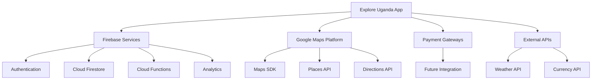

# API & Integrations

## Overview

The Explore Uganda App integrates with various APIs and services to provide a comprehensive tourism and investment platform.



## Firebase Services Integration

### Authentication API
```dart
// Authentication Service Interface
abstract class AuthenticationService {
  Future<UserCredential> signInWithGoogle();
  Future<UserCredential> signInWithEmailPassword(String email, String password);
  Future<void> signOut();
  Stream<User?> get authStateChanges;
}

// Implementation
class FirebaseAuthService implements AuthenticationService {
  final FirebaseAuth _auth = FirebaseAuth.instance;
  
  @override
  Future<UserCredential> signInWithGoogle() async {
    // Google Sign-In implementation
  }
  
  @override
  Future<UserCredential> signInWithEmailPassword(
    String email, 
    String password
  ) async {
    // Email/Password Sign-In implementation
  }
}
```

### Cloud Firestore API
```dart
// Database Service Interface
abstract class DatabaseService {
  Future<void> createUser(UserModel user);
  Future<void> updateUser(String userId, Map<String, dynamic> data);
  Stream<List<Event>> getEvents();
  Future<List<Attraction>> getNearbyAttractions(LatLng location);
}

// Implementation
class FirestoreService implements DatabaseService {
  final FirebaseFirestore _db = FirebaseFirestore.instance;
  
  @override
  Future<void> createUser(UserModel user) async {
    // User creation implementation
  }
  
  @override
  Stream<List<Event>> getEvents() {
    // Events stream implementation
  }
}
```

## Google Maps Integration

### Maps Configuration
```dart
// Maps Configuration
class MapsConfig {
  static const apiKey = 'YOUR_API_KEY';
  static const defaultLocation = LatLng(0.347596, 32.582520); // Kampala
  static const defaultZoom = 14.0;
  
  static final mapStyle = [
    // Custom map style configuration
  ];
}
```

### Location Services
```dart
// Location Service Interface
abstract class LocationService {
  Future<Position> getCurrentLocation();
  Future<List<Place>> searchNearbyPlaces(LatLng location, String type);
  Future<DirectionsResult> getDirections(LatLng origin, LatLng destination);
}

// Implementation
class GoogleMapsService implements LocationService {
  final Geolocator _geolocator = Geolocator();
  
  @override
  Future<Position> getCurrentLocation() async {
    // Location implementation
  }
  
  @override
  Future<List<Place>> searchNearbyPlaces(LatLng location, String type) async {
    // Places search implementation
  }
}
```

## External API Integrations

### Weather API
```dart
// Weather Service Interface
abstract class WeatherService {
  Future<Weather> getCurrentWeather(LatLng location);
  Future<List<Weather>> getForecast(LatLng location, int days);
}

// Implementation
class WeatherAPIService implements WeatherService {
  final String apiKey = 'YOUR_WEATHER_API_KEY';
  final http.Client _client = http.Client();
  
  @override
  Future<Weather> getCurrentWeather(LatLng location) async {
    // Weather API implementation
  }
}
```

### Currency Converter API
```dart
// Currency Service Interface
abstract class CurrencyService {
  Future<double> getExchangeRate(String from, String to);
  Future<Map<String, double>> getAllRates(String base);
}

// Implementation
class CurrencyAPIService implements CurrencyService {
  final String apiKey = 'YOUR_CURRENCY_API_KEY';
  
  @override
  Future<double> getExchangeRate(String from, String to) async {
    // Currency API implementation
  }
}
```

## API Security

### API Key Management
```dart
// API Key Manager
class APIKeyManager {
  static const _secureStorage = FlutterSecureStorage();
  
  static Future<String> getAPIKey(String service) async {
    return await _secureStorage.read(key: service) ?? '';
  }
  
  static Future<void> setAPIKey(String service, String key) async {
    await _secureStorage.write(key: service, value: key);
  }
}
```

### Request Authentication
```dart
// API Client
class APIClient {
  final dio = Dio();
  
  APIClient() {
    dio.interceptors.add(AuthInterceptor());
  }
}

// Auth Interceptor
class AuthInterceptor extends Interceptor {
  @override
  void onRequest(RequestOptions options, RequestInterceptorHandler handler) {
    // Add authentication headers
    options.headers['Authorization'] = 'Bearer ${getToken()}';
    super.onRequest(options, handler);
  }
}
```

## Error Handling

### API Error Handling
```dart
// API Error Handler
class APIError implements Exception {
  final String message;
  final int? statusCode;
  
  APIError(this.message, {this.statusCode});
  
  @override
  String toString() => 'APIError: $message (Status: $statusCode)';
}

// Error Handler Implementation
Future<T> handleAPIError<T>(Future<T> Function() request) async {
  try {
    return await request();
  } on DioError catch (e) {
    throw APIError(e.message, statusCode: e.response?.statusCode);
  } catch (e) {
    throw APIError(e.toString());
  }
}
```

## Rate Limiting

### Request Rate Limiting
```dart
// Rate Limiter
class RateLimiter {
  final Duration timeout;
  final int maxRequests;
  final _timestamps = <DateTime>[];
  
  RateLimiter({
    this.timeout = const Duration(minutes: 1),
    this.maxRequests = 30,
  });
  
  bool canMakeRequest() {
    final now = DateTime.now();
    _timestamps.removeWhere((stamp) => now.difference(stamp) > timeout);
    
    if (_timestamps.length >= maxRequests) return false;
    
    _timestamps.add(now);
    return true;
  }
}
```

## Future API Integrations

### Planned Integrations
- Payment Gateway API
- Social Media APIs
- Booking System API
- Chat System API
- Analytics API

### Integration Requirements
1. Security compliance
2. Performance optimization
3. Error handling
4. Rate limiting
5. Documentation

## Related Documentation
- [System Overview](System-Overview)
- [Security & Permissions](Security-and-Permissions)
- [Deployment Guide](Deployment-Guide) 