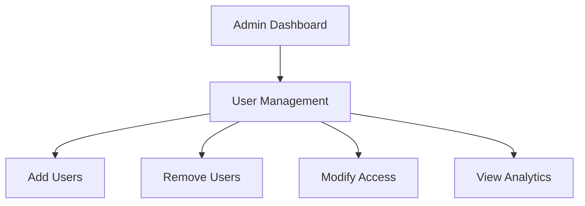
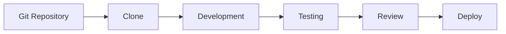
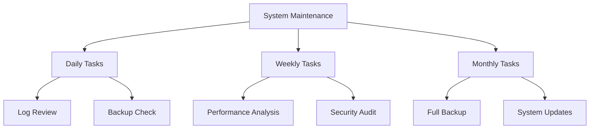
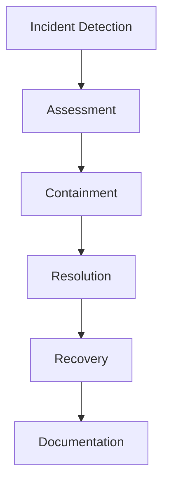

# Administrator Guide

## Overview

This guide provides comprehensive information for administrators managing the Explore Uganda App platform.

## Administrative Rights

### User Management


### Content Management
- Create and update sections
  - Deals
  - Attractions
  - Accommodations
  - Investments
- Manage location information
- Update media content
- Monitor user-generated content

### Feature Control
- Enable/disable app features
- Manage third-party integrations
- Control access permissions
- Configure system settings

## Technical Access

### Source Code Management


### Development Environment
- Repository access
- Branch management
- Code review process
- Deployment procedures

## Content Management

### Data Input Guidelines
```dart
// Example Content Structure
class ContentItem {
  final String title;
  final String description;
  final List<String> images;
  final Map<String, dynamic> metadata;
  final DateTime lastUpdated;
  
  // Content validation
  bool validate() {
    return title.isNotEmpty &&
           description.isNotEmpty &&
           images.isNotEmpty &&
           metadata.containsKey('category');
  }
}
```

### Required Fields
1. Basic Information
   - Title
   - Description
   - Category
   - Location

2. Media Content
   - Images (minimum 1)
   - Videos (optional)
   - Audio guides (optional)

3. Contact Details
   - Phone numbers
   - Email addresses
   - Website links
   - Social media

4. Additional Information
   - Operating hours
   - Pricing details
   - Special requirements
   - Accessibility information

## Quality Control

### Content Verification
1. Accuracy Check
   - Information verification
   - Location accuracy
   - Contact details validation
   - Price verification

2. Media Quality
   - Image resolution
   - Video quality
   - Audio clarity
   - File format compliance

3. Legal Compliance
   - Copyright verification
   - Terms compliance
   - Privacy requirements
   - Local regulations

## System Maintenance

### Regular Tasks


### Backup Procedures
1. Database Backup
   - Daily incremental
   - Weekly full backup
   - Monthly archive
   - Verification process

2. Media Backup
   - Image storage
   - Video content
   - Document archives
   - User uploads

## Security Management

### Access Control
```dart
// Example Access Control Implementation
class AccessControl {
  final String role;
  final List<String> permissions;
  
  bool hasPermission(String action) {
    return permissions.contains(action);
  }
  
  bool isAdmin() {
    return role == 'admin';
  }
  
  bool canModifyContent(String contentType) {
    return isAdmin() || hasPermission('modify_$contentType');
  }
}
```

### Security Protocols
1. User Authentication
   - Multi-factor authentication
   - Session management
   - Access logging
   - Security alerts

2. Data Protection
   - Encryption standards
   - Data handling
   - Privacy compliance
   - Security audits

## Performance Monitoring

### Analytics Dashboard
- User engagement metrics
- Content performance
- System health
- Error tracking

### Reporting Tools
- Usage statistics
- Error reports
- Performance metrics
- User feedback

## Training Resources

### Documentation
1. Technical Guides
   - System architecture
   - Code documentation
   - API references
   - Integration guides

2. Process Documentation
   - Workflow guides
   - Best practices
   - Standard procedures
   - Troubleshooting

### Support Resources
- Training materials
- Video tutorials
- Knowledge base
- Support contacts

## Emergency Procedures

### Incident Response


### Recovery Procedures
1. System Recovery
   - Backup restoration
   - Service recovery
   - Data verification
   - System validation

2. Communication Plan
   - User notifications
   - Team coordination
   - Status updates
   - Post-incident review

## Related Documentation
- [System Overview](System-Overview)
- [Security & Permissions](Security-and-Permissions)
- [API Documentation](API-and-Integrations) 