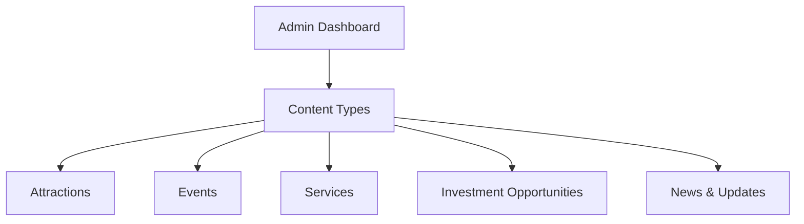
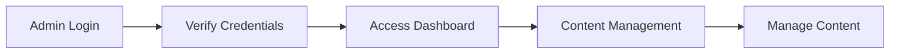
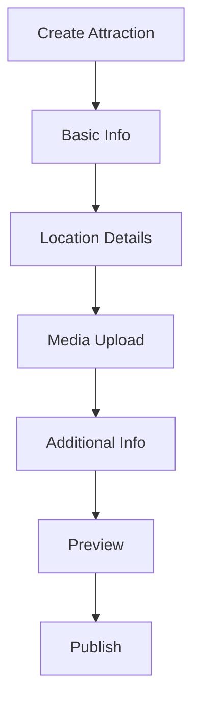
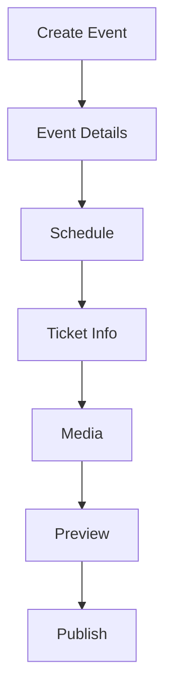
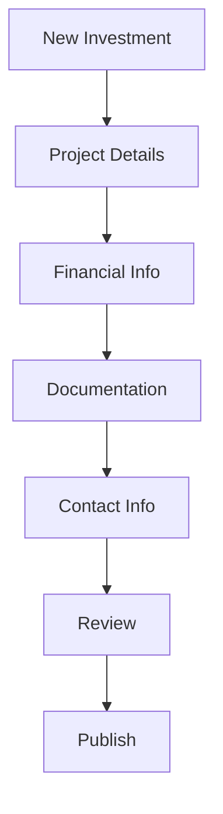
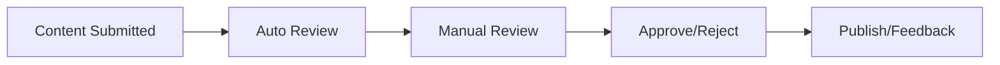
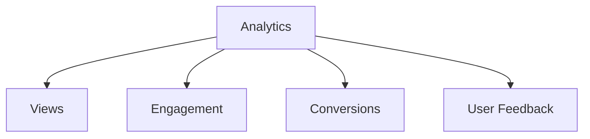

# Content Management Guide

## Overview

The Content Management System (CMS) for Explore Uganda App provides administrators with tools to manage all content types including attractions, events, services, and investment opportunities.



## Access and Authentication

### Admin Access


### Permission Levels
| Role | Permissions |
|------|------------|
| Super Admin | Full access to all features |
| Content Manager | Create, edit, delete content |
| Moderator | Review and approve content |
| Editor | Edit existing content |

## Content Management Interface

### Navigation
1. **More Tab**
   - Access Admin Panel
   - Content Dashboard
   - Analytics Overview
   - User Management

2. **Quick Actions**
   - Add New Content
   - Review Pending
   - Recent Updates
   - Content Calendar

### Dashboard Layout
```dart
// Example Dashboard Structure
class AdminDashboard {
  final List<ContentType> contentTypes = [
    ContentType(
      name: 'Attractions',
      icon: Icons.place,
      addRoute: '/admin/attractions/add',
      listRoute: '/admin/attractions',
    ),
    ContentType(
      name: 'Events',
      icon: Icons.event,
      addRoute: '/admin/events/add',
      listRoute: '/admin/events',
    ),
    // More content types...
  ];
}
```

## Managing Attractions

### Adding New Attractions


### Required Fields
```dart
// Attraction Model
class Attraction {
  final String id;
  final String name;
  final String description;
  final LatLng location;
  final List<String> images;
  final Map<String, dynamic> details;
  final String category;
  final bool isActive;
  final DateTime createdAt;
  final DateTime updatedAt;
  
  // Validation
  bool validate() {
    return name.isNotEmpty &&
           description.isNotEmpty &&
           images.isNotEmpty &&
           location != null;
  }
}
```

### Media Guidelines
1. **Images**
   - Minimum resolution: 1920x1080
   - Format: JPG, PNG
   - Max size: 5MB
   - Required: 3-10 images

2. **Videos**
   - Format: MP4
   - Max duration: 3 minutes
   - Max size: 100MB
   - Optional

## Event Management

### Creating Events


### Event Configuration
```dart
// Event Model
class Event {
  final String id;
  final String title;
  final String description;
  final DateTime startDate;
  final DateTime endDate;
  final LatLng venue;
  final List<TicketType> tickets;
  final List<String> images;
  final EventCategory category;
  
  // Scheduling validation
  bool validateSchedule() {
    return startDate.isAfter(DateTime.now()) &&
           endDate.isAfter(startDate);
  }
}
```

## Service Management

### Adding Services
1. **Service Types**
   - Accommodation
   - Transportation
   - Tour Guides
   - Restaurants
   - Activities

2. **Required Information**
   ```dart
   // Service Model
   class Service {
     final String id;
     final String name;
     final ServiceType type;
     final String description;
     final List<String> amenities;
     final PriceRange priceRange;
     final BusinessHours hours;
     final ContactInfo contact;
     
     // Availability management
     Future<bool> checkAvailability(DateTime date) async {
       // Check booking calendar
       return await BookingSystem.isAvailable(id, date);
     }
   }
   ```

## Investment Opportunities

### Creating Investment Listings


### Investment Details
```dart
// Investment Model
class Investment {
  final String id;
  final String title;
  final String description;
  final double amount;
  final List<String> documents;
  final List<String> images;
  final InvestmentType type;
  final ROIDetails roi;
  
  // ROI calculation
  double calculateROI() {
    return roi.calculateAnnualReturn();
  }
}
```

## Content Moderation

### Review Process


### Moderation Tools
1. **Content Review**
   - Inappropriate content detection
   - Duplicate checking
   - Quality assessment
   - Compliance verification

2. **Action Tools**
   - Approve/Reject
   - Edit/Update
   - Flag for review
   - Send feedback

## Media Management

### Asset Library
```dart
// Media Manager
class MediaManager {
  final Storage _storage = Storage();
  
  Future<String> uploadImage(File file, String path) async {
    // Validate file
    if (!_isValidImage(file)) {
      throw InvalidFileException();
    }
    
    // Optimize image
    final optimized = await ImageOptimizer.optimize(file);
    
    // Upload
    return await _storage.upload(optimized, path);
  }
}
```

### Media Operations
1. **Upload**
   - Drag and drop support
   - Bulk upload
   - Progress tracking
   - Auto-optimization

2. **Management**
   - Organize by folders
   - Search functionality
   - Batch operations
   - Usage tracking

## SEO Management

### SEO Tools
1. **Meta Information**
   - Title optimization
   - Description management
   - Keyword integration
   - URL structure

2. **Content Optimization**
   - Keyword analysis
   - Content scoring
   - Readability check
   - Mobile optimization

## Analytics and Reporting

### Content Performance


### Report Generation
1. **Standard Reports**
   - Content performance
   - User engagement
   - Conversion rates
   - Traffic analysis

2. **Custom Reports**
   - Date range selection
   - Custom metrics
   - Export options
   - Scheduled reports

## Related Documentation
- [Administrator Guide](Administrator-Guide)
- [Security & Permissions](Security-and-Permissions)
- [API Documentation](API-and-Integrations)
- [User Guide](User-Guide) 