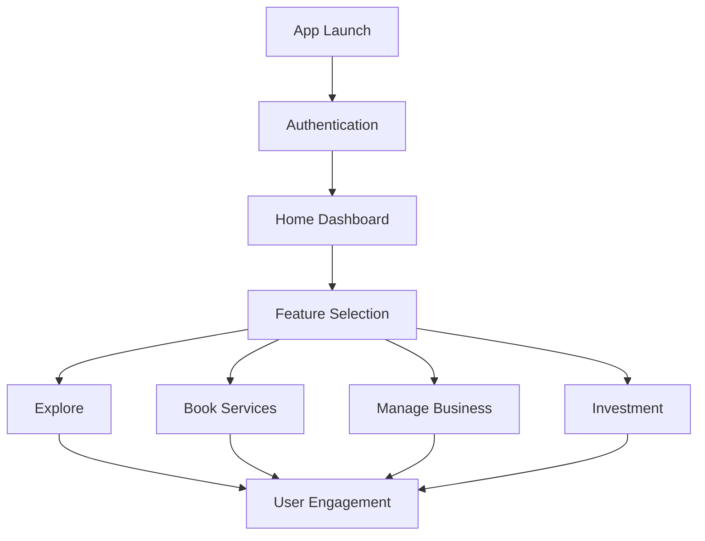
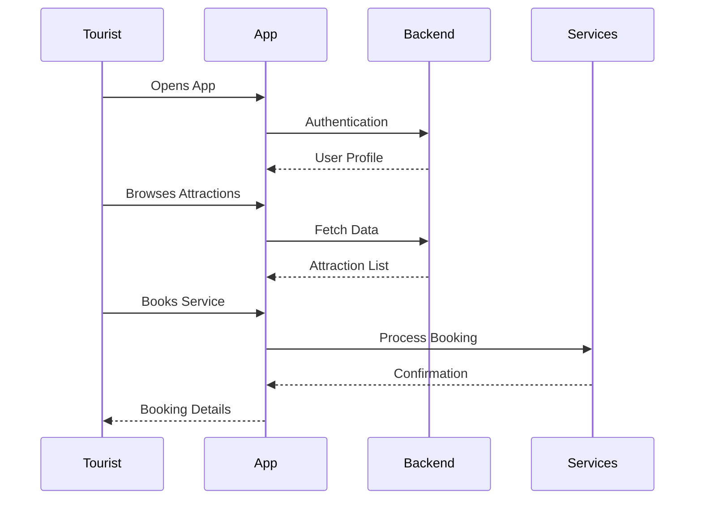
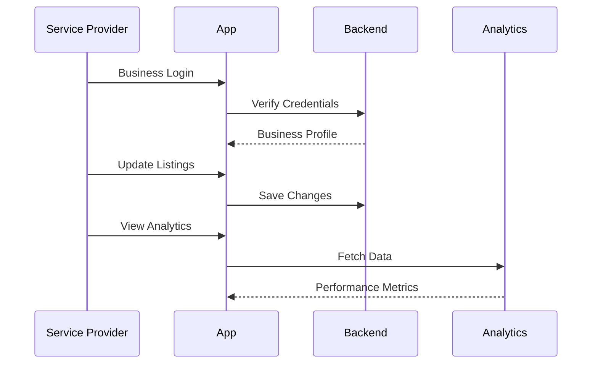
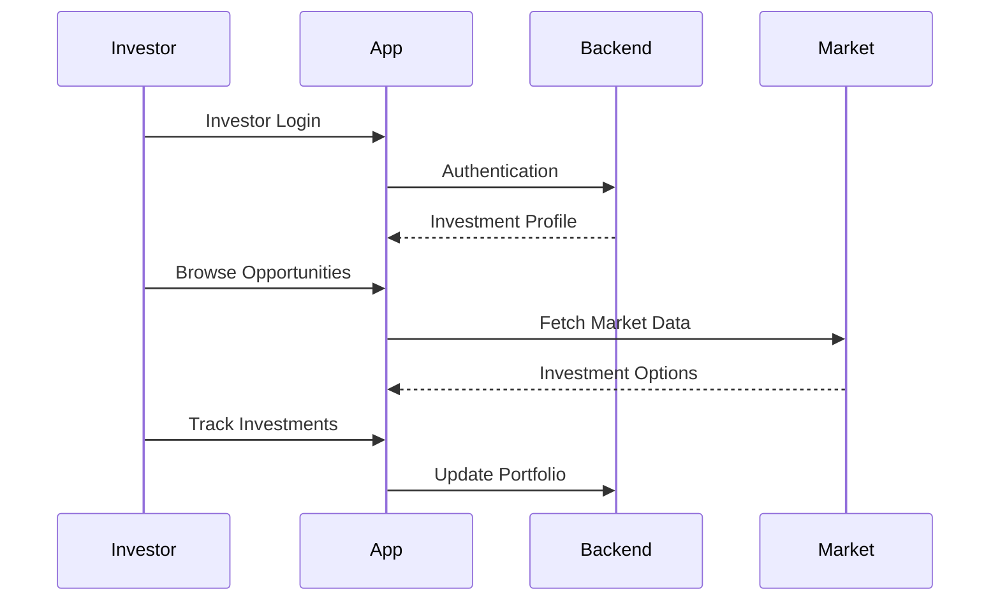
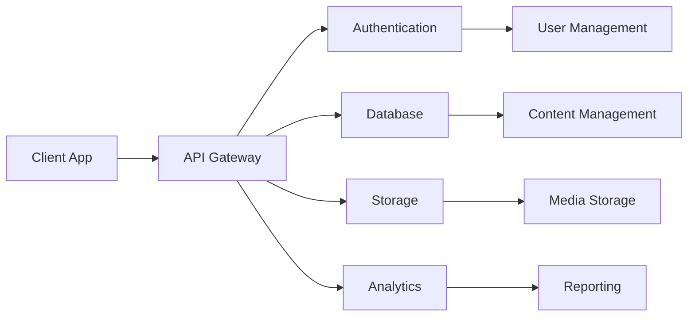
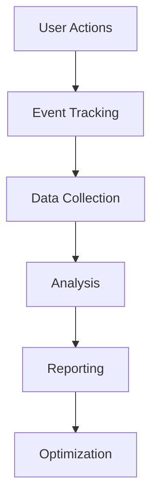
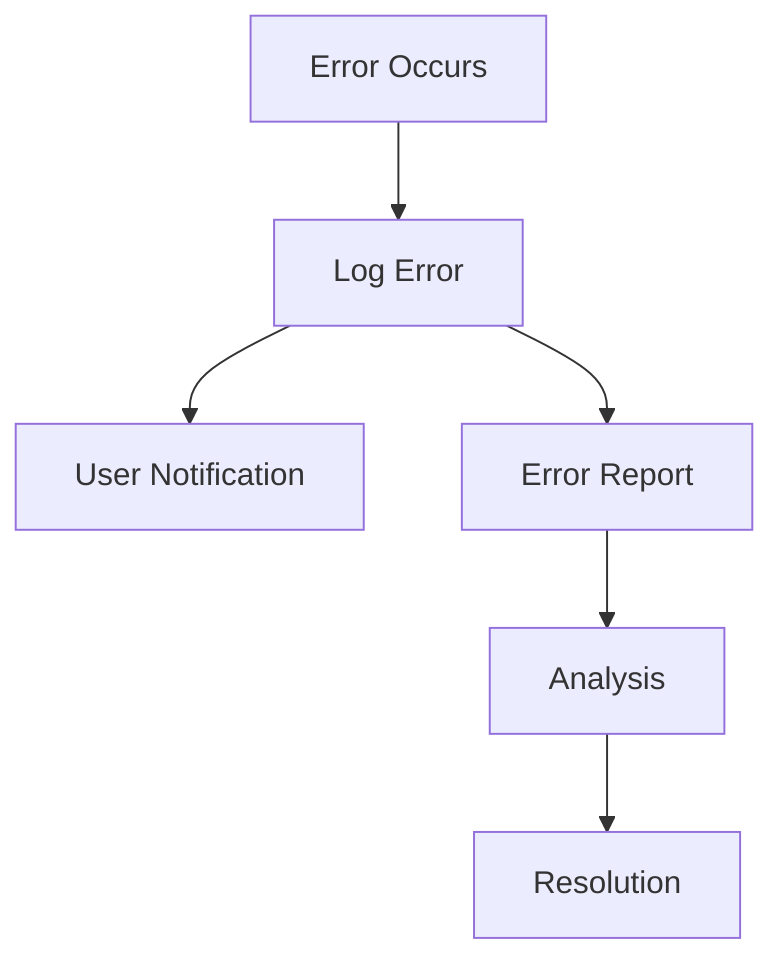

# Data Flow & User Journey

## User Journey Overview



## User Types and Flows

### Tourist Journey


### Service Provider Journey


### Investor Journey


## Data Flow Architecture

### Core Data Flows


### Real-time Data Flow
```dart
// Example Real-time Data Implementation
class RealTimeService {
  final FirebaseFirestore _db = FirebaseFirestore.instance;
  
  Stream<List<Event>> getLiveEvents() {
    return _db.collection('events')
        .where('status', isEqualTo: 'active')
        .snapshots()
        .map((snapshot) => snapshot.docs
            .map((doc) => Event.fromJson(doc.data()))
            .toList());
  }
}
```

## User Interaction Patterns

### Authentication Flow
1. **Initial Access**
   - App launch
   - Splash screen
   - Authentication check
   - Login/Register option

2. **User Verification**
   ```mermaid
   graph TD
       A[Start] --> B{User Type}
       B -->|Tourist| C[Simple Auth]
       B -->|Business| D[Extended Auth]
       B -->|Investor| E[Advanced Auth]
       C --> F[Profile Setup]
       D --> G[Business Verification]
       E --> H[Investment Profile]
   ```

### Content Discovery Flow
1. **Browse & Search**
   - Category navigation
   - Search functionality
   - Filters and sorting
   - Results display

2. **Content Interaction**
   ```mermaid
   graph LR
       A[View Content] --> B[Like/Save]
       A --> C[Share]
       A --> D[Book/Purchase]
       A --> E[Review]
   ```

## Data Management

### Data Categories
1. **User Data**
   - Profile information
   - Preferences
   - Activity history
   - Saved items

2. **Business Data**
   - Service listings
   - Booking records
   - Analytics data
   - Performance metrics

3. **Content Data**
   - Attractions
   - Events
   - Services
   - Media assets

### Data Synchronization
```dart
// Example Sync Implementation
class DataSyncService {
  final LocalStorage _local = LocalStorage();
  final CloudStorage _cloud = CloudStorage();
  
  Future<void> syncData() async {
    try {
      final localData = await _local.getData();
      final cloudData = await _cloud.getData();
      
      final mergedData = await _mergeData(localData, cloudData);
      await _updateStorage(mergedData);
    } catch (e) {
      // Handle sync errors
    }
  }
}
```

## Performance Optimization

### Data Loading Strategies
1. **Lazy Loading**
   - Load data on demand
   - Implement pagination
   - Cache frequently accessed data

2. **Prefetching**
   - Anticipate user needs
   - Background data loading
   - Smart caching

### Caching Implementation
```dart
// Example Cache Implementation
class CacheManager {
  final Cache _cache = Cache();
  
  Future<T> getData<T>(String key, Future<T> Function() fetchData) async {
    if (await _cache.has(key)) {
      return await _cache.get(key);
    }
    
    final data = await fetchData();
    await _cache.set(key, data);
    return data;
  }
}
```

## Analytics and Monitoring

### User Analytics
1. **Tracking Points**
   - Screen views
   - Feature usage
   - User engagement
   - Conversion rates

2. **Performance Metrics**
   - Load times
   - Response times
   - Error rates
   - User satisfaction

### Monitoring Flow


## Error Handling

### Error Flow


### Recovery Procedures
1. **Data Recovery**
   - Backup restoration
   - State recovery
   - Session management
   - Error correction

2. **User Communication**
   - Error messages
   - Status updates
   - Recovery instructions
   - Support options

## Related Documentation
- [System Overview](System-Overview)
- [API Documentation](API-and-Integrations)
- [User Guide](User-Guide)
- [Technical Documentation](Technology-Stack) 