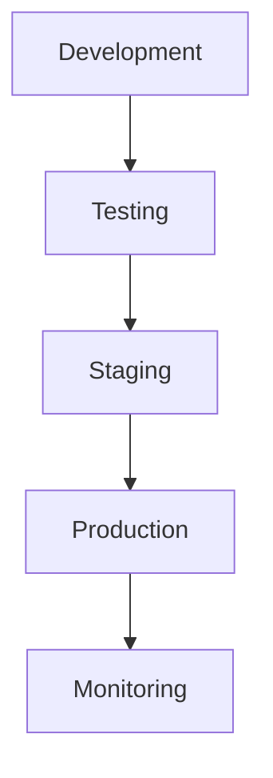
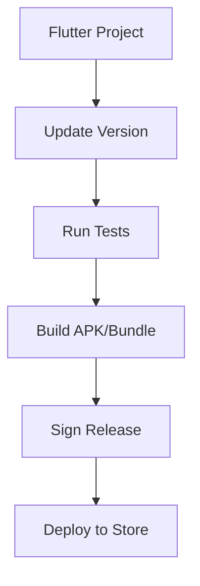
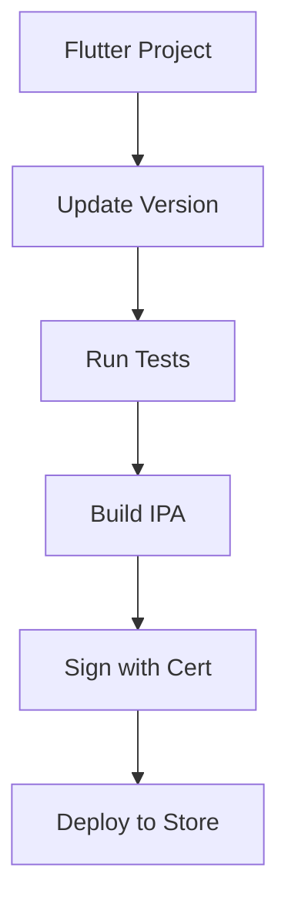
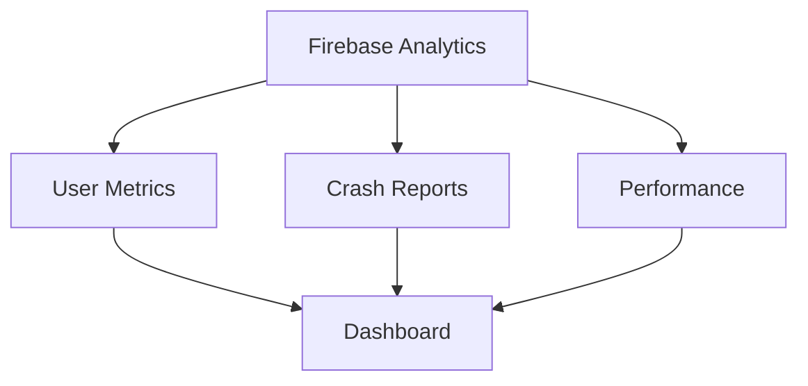
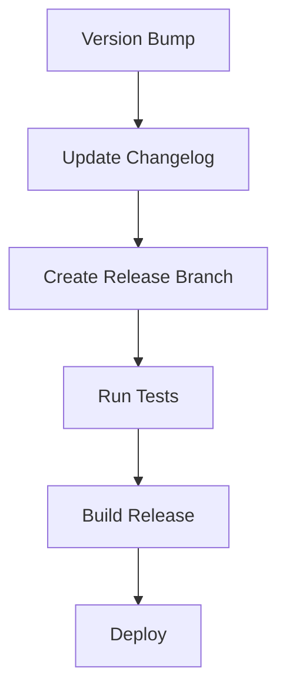

# Deployment Guide

## Overview

This guide covers the deployment process for the Explore Uganda App, including environment setup, build processes, and maintenance procedures.



## Environment Setup

### Prerequisites
1. **Development Environment**
   ```bash
   # Required tools and versions
   Flutter SDK: 3.x.x
   Dart SDK: 3.x.x
   Node.js: 16.x.x
   Firebase CLI: Latest
   Android Studio / Xcode
   ```

2. **Firebase Setup**
   ```bash
   # Install Firebase CLI
   npm install -g firebase-tools
   
   # Login to Firebase
   firebase login
   
   # Initialize project
   firebase init
   ```

3. **Environment Configuration**
   ```dart
   // lib/config/env.dart
   class Environment {
     static const environment = String.fromEnvironment('ENV', defaultValue: 'dev');
     static const apiKey = String.fromEnvironment('API_KEY');
     static const firebaseProjectId = String.fromEnvironment('FIREBASE_PROJECT_ID');
     
     static bool get isDevelopment => environment == 'dev';
     static bool get isProduction => environment == 'prod';
   }
   ```

## Build Process

### Android Build


1. **Build Commands**
   ```bash
   # Development build
   flutter build apk --debug
   
   # Production build
   flutter build appbundle --release \
     --dart-define=ENV=prod \
     --dart-define=API_KEY=your_api_key
   ```

2. **Signing Configuration**
   ```gradle
   android {
     signingConfigs {
       release {
         storeFile file("keystore.jks")
         storePassword System.getenv("KEYSTORE_PASSWORD")
         keyAlias System.getenv("KEY_ALIAS")
         keyPassword System.getenv("KEY_PASSWORD")
       }
     }
   }
   ```

### iOS Build


1. **Build Commands**
   ```bash
   # Development build
   flutter build ios --debug
   
   # Production build
   flutter build ios --release \
     --dart-define=ENV=prod \
     --dart-define=API_KEY=your_api_key
   ```

2. **Signing Process**
   - Update certificates in Apple Developer Portal
   - Configure signing in Xcode
   - Archive and upload to App Store Connect

## Deployment Pipeline

### CI/CD Setup
```yaml
# .github/workflows/main.yml
name: CI/CD Pipeline
on:
  push:
    branches: [main]
  pull_request:
    branches: [main]

jobs:
  build:
    runs-on: ubuntu-latest
    steps:
      - uses: actions/checkout@v2
      - uses: subosito/flutter-action@v2
      - name: Install Dependencies
        run: flutter pub get
      - name: Run Tests
        run: flutter test
      - name: Build APK
        run: flutter build apk --release
```

### Automated Testing
```dart
// Example Integration Test
void main() {
  IntegrationTestWidgetsFlutterBinding.ensureInitialized();

  group('End-to-end test', () {
    testWidgets('Complete user journey', (tester) async {
      await tester.pumpWidget(MyApp());
      // Test critical paths
    });
  });
}
```

## Server Deployment

### Firebase Configuration
1. **Functions Deployment**
   ```bash
   # Deploy all functions
   firebase deploy --only functions
   
   # Deploy specific function
   firebase deploy --only functions:functionName
   ```

2. **Security Rules**
   ```javascript
   // firestore.rules
   rules_version = '2';
   service cloud.firestore {
     match /databases/{database}/documents {
       match /{document=**} {
         allow read: if true;
         allow write: if request.auth != null;
       }
     }
   }
   ```

### Database Migration
```dart
// Example Migration Script
class DatabaseMigration {
  final FirebaseFirestore _db = FirebaseFirestore.instance;
  
  Future<void> migrateData() async {
    // Backup current data
    await backupCollection('users');
    
    // Perform migration
    final batch = _db.batch();
    // Add migration logic
    await batch.commit();
  }
}
```

## Monitoring & Maintenance

### Performance Monitoring


### Health Checks
```dart
// Health Check Service
class HealthCheckService {
  Future<HealthStatus> checkSystemHealth() async {
    final checks = await Future.wait([
      checkDatabaseConnection(),
      checkAPIStatus(),
      checkStorageAccess(),
    ]);
    
    return HealthStatus(
      isHealthy: checks.every((check) => check.isHealthy),
      details: checks,
    );
  }
}
```

## Backup & Recovery

### Automated Backups
1. **Database Backup**
   ```bash
   # Firestore export
   gcloud firestore export gs://backup-bucket
   
   # Schedule regular backups
   0 0 * * * gcloud firestore export gs://backup-bucket/$(date +%Y%m%d)
   ```

2. **Media Backup**
   ```dart
   // Media Backup Service
   class MediaBackupService {
     Future<void> backupMedia() async {
       final storage = FirebaseStorage.instance;
       final backup = BackupStorage();
       
       // Backup media files
       await backup.copyFiles(storage);
     }
   }
   ```

## Version Management

### Release Process


### Rollback Procedures
1. **Quick Rollback**
   ```bash
   # Revert to previous version
   git revert HEAD
   
   # Force push to production
   git push origin main --force
   ```

2. **Database Rollback**
   ```dart
   class DatabaseRollback {
     Future<void> rollbackToVersion(String version) async {
       final backup = await loadBackup(version);
       await restoreFromBackup(backup);
     }
   }
   ```

## Security Measures

### Security Checklist
1. **Pre-deployment**
   - Code security scan
   - Dependency check
   - API key rotation
   - SSL certificate verification

2. **Post-deployment**
   - Security monitoring
   - Access log review
   - Vulnerability scanning
   - Performance analysis

## Related Documentation
- [System Overview](System-Overview)
- [Security & Permissions](Security-and-Permissions)
- [API Documentation](API-and-Integrations)
- [Administrator Guide](Administrator-Guide) 