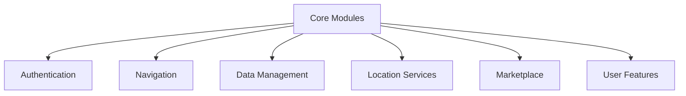

# Modules Breakdown

## Core Modules Overview



## Authentication Module

### Components
1. **Firebase Authentication**
   - Google Sign-In integration
   - Email/Password authentication
   - Apple Sign-In (planned)
   - JWT token management

2. **Session Management**
   - Secure token storage
   - Auto-refresh mechanism
   - Multi-device support
   - Logout handling

### Implementation Details
```dart
// Example Authentication Implementation
class AuthService {
  final FirebaseAuth _auth = FirebaseAuth.instance;
  
  Future<UserCredential> signInWithGoogle() async {
    final GoogleSignInAccount? googleUser = await GoogleSignIn().signIn();
    final GoogleSignInAuthentication? googleAuth = await googleUser?.authentication;
    
    final credential = GoogleAuthProvider.credential(
      accessToken: googleAuth?.accessToken,
      idToken: googleAuth?.idToken,
    );
    
    return await _auth.signInWithCredential(credential);
  }
}
```

## Navigation Module

### Top Navigation Bar
- Profile access button
- Wishlist counter
- Search functionality
- Notification center

### Bottom Navigation
1. **Home Tab**
   - Featured content carousel
   - Quick access buttons
   - Recent activities
   - Personalized recommendations

2. **To-Do Tab**
   - Category filters:
     ```
     - Music Events
     - Art Exhibitions
     - Agricultural Shows
     - Tech Conferences
     - Food Festivals
     - MICE Events
     ```
   - Event details view
   - Booking integration
   - Calendar sync

3. **Explore Tab**
   - Google Maps integration
   - Location tracking
   - POI markers
   - Route planning

4. **Marketplace Tab**
   - Service provider listings
   - Booking system
   - Review system
   - Payment integration

5. **More Features Tab**
   - Settings management
   - User preferences
   - Support access
   - Additional tools

## Location Services Module

### Google Maps Integration
```dart
// Example Maps Implementation
class MapService {
  final Completer<GoogleMapController> _controller = Completer();
  
  Future<void> initializeMap() async {
    Position position = await Geolocator.getCurrentPosition();
    final GoogleMapController controller = await _controller.future;
    
    controller.animateCamera(CameraUpdate.newCameraPosition(
      CameraPosition(
        target: LatLng(position.latitude, position.longitude),
        zoom: 14.0,
      ),
    ));
  }
}
```

### Features
- Real-time location tracking
- Custom map markers
- Route optimization
- Geofencing capabilities

## Data Management Module

### Cloud Firestore Structure
```
├── users/
│   ├── {userId}/
│   │   ├── profile
│   │   ├── preferences
│   │   └── history
├── locations/
│   ├── attractions/
│   ├── accommodations/
│   └── services/
└── events/
    ├── current/
    ├── upcoming/
    └── categories/
```

### Real-time Sync
- Live data updates
- Offline persistence
- Conflict resolution
- Data validation

## Marketplace Module

### Service Provider Management
- Business profile creation
- Service listings
- Pricing management
- Availability calendar

### Booking System
- Real-time availability
- Instant booking
- Payment processing
- Confirmation system

### Review System
```dart
// Example Review System
class ReviewSystem {
  final FirebaseFirestore _firestore = FirebaseFirestore.instance;
  
  Future<void> submitReview({
    required String serviceId,
    required String userId,
    required double rating,
    required String comment,
  }) async {
    await _firestore
        .collection('reviews')
        .doc()
        .set({
          'serviceId': serviceId,
          'userId': userId,
          'rating': rating,
          'comment': comment,
          'timestamp': FieldValue.serverTimestamp(),
        });
  }
}
```

## User Features Module

### Profile Management
- Personal information
- Preferences settings
- Activity history
- Saved items

### Language Support
- Multi-language interface
- Real-time translation
- Regional settings
- Custom localization

### Currency Converter
- Real-time exchange rates
- Multiple currency support
- Conversion history
- Offline rates

## Error Handling & Monitoring

### Crashlytics Integration
```dart
// Example Crashlytics Implementation
void initializeCrashlytics() {
  FirebaseCrashlytics.instance.setCrashlyticsCollectionEnabled(true);
  
  FlutterError.onError = FirebaseCrashlytics.instance.recordFlutterError;
  
  FirebaseCrashlytics.instance.setCustomKey('last_action', 'app_startup');
}
```

### Error Tracking
- Automated crash reporting
- Error logging
- Performance monitoring
- User feedback collection

## Future Enhancements

### Planned Features
- [ ] Offline mode optimization
- [ ] Advanced search capabilities
- [ ] AR navigation features
- [ ] Social sharing integration
- [ ] Payment gateway integration
- [ ] Chat system implementation

### Performance Improvements
- Cache optimization
- Load time reduction
- Battery usage optimization
- Memory management

## Related Documentation
- [System Overview](System-Overview)
- [Technology Stack](Technology-Stack)
- [API Documentation](API-and-Integrations)
- [Security & Permissions](Security-and-Permissions) 