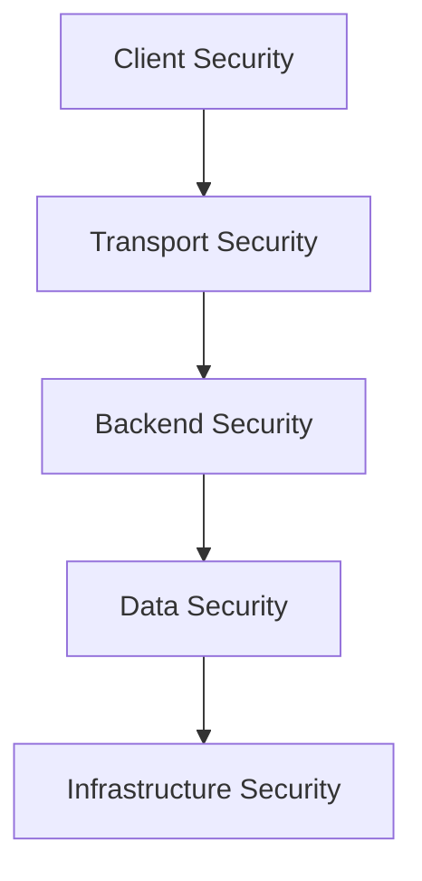
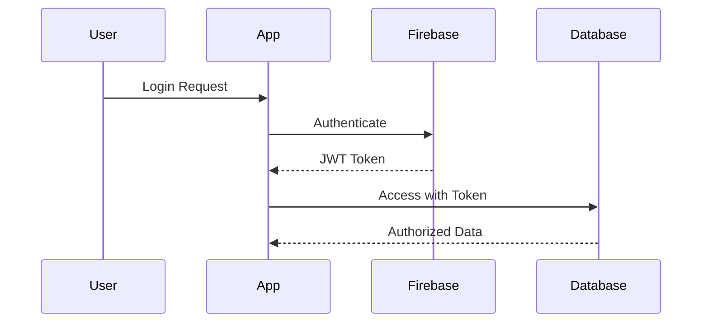

# Security & Permissions

## Security Architecture Overview



## Authentication System

### User Authentication Flow


### Authentication Methods
- Email/Password
- Google Sign-In
- Apple Sign-In (iOS)
- Phone Number Verification

### Session Management
- JWT token-based authentication
- Automatic token refresh
- Secure token storage
- Session timeout handling

## Data Security

### Encryption
- **In Transit**
  - TLS 1.3 encryption
  - Certificate pinning
  - Secure websocket connections
  - HTTPS-only communication

- **At Rest**
  - AES-256 encryption
  - Encrypted shared preferences
  - Secure key storage
  - Firebase encryption

### Access Control

#### Role-Based Access Control (RBAC)
| Role | Permissions |
|------|------------|
| Admin | Full system access |
| Moderator | Content management |
| Service Provider | Business management |
| Tourist | Basic app features |

#### Firestore Security Rules
```javascript
rules_version = '2';
service cloud.firestore {
  match /databases/{database}/documents {
    // User profiles
    match /users/{userId} {
      allow read: if request.auth != null;
      allow write: if request.auth.uid == userId;
    }
    
    // Public data
    match /attractions/{attractionId} {
      allow read: if true;
      allow write: if request.auth != null && hasModeratorRole();
    }
  }
}
```

## API Security

### API Protection
- Rate limiting
- Request validation
- API key rotation
- IP whitelisting

### Third-Party API Security
- Secure key management
- Access token rotation
- Scope limitation
- Request auditing

## Device Security

### Mobile Security
- Biometric authentication
- App data encryption
- Secure key storage
- Screenshot prevention
- Root/Jailbreak detection

### Local Storage Security
- Encrypted shared preferences
- Secure file storage
- Cache security
- Temporary file handling

## Monitoring & Compliance

### Security Monitoring
- Real-time threat detection
- Automated security scanning
- Vulnerability assessment
- Penetration testing

### Compliance
- GDPR compliance
- Data privacy
- User consent management
- Data retention policies

## Incident Response

### Security Incident Handling
1. Detection
2. Analysis
3. Containment
4. Eradication
5. Recovery
6. Lessons Learned

### Emergency Procedures
- Account lockout
- Force logout
- Emergency notifications
- Data recovery

## Best Practices Implementation

### Code Security
- Input validation
- Output encoding
- Error handling
- Secure logging

### Development Security
- Secure code review
- Dependency scanning
- Static code analysis
- Dynamic testing

## Security Configurations

### Firebase Security
```javascript
{
  "rules": {
    ".read": "auth != null",
    ".write": "auth != null && root.child('users').child(auth.uid).child('role').val() === 'admin'"
  }
}
```

### API Security Headers
```yaml
Security Headers:
  - X-Content-Type-Options: nosniff
  - X-Frame-Options: DENY
  - X-XSS-Protection: 1; mode=block
  - Strict-Transport-Security: max-age=31536000; includeSubDomains
  - Content-Security-Policy: default-src 'self'
```

## Regular Security Tasks

### Daily
- Log monitoring
- Incident review
- Access control audit
- Backup verification

### Weekly
- Security patch review
- User activity audit
- Performance monitoring
- Threat assessment

### Monthly
- Security testing
- Policy review
- Access recertification
- Compliance check

## Related Documentation
- [System Overview](System-Overview)
- [API Documentation](API-and-Integrations)
- [Deployment Guide](Deployment-Guide) 