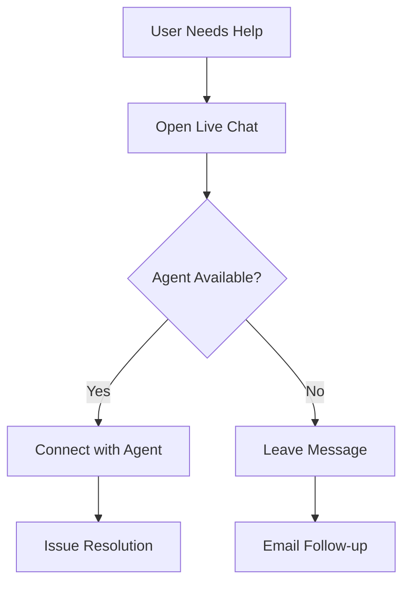

# Support Guide

## Getting Help

### Quick Support Options
1. **In-App Support**
   - Live chat available 24/7
   - Help center with searchable articles
   - FAQ section
   - Video tutorials

2. **Email Support**
   - support@exploreuganda.app
   - Response time: 24-48 hours
   - Business hours: Monday-Friday, 9 AM - 5 PM EAT

3. **Emergency Support**
   - Available 24/7 for urgent issues
   - Priority response for business-critical issues
   - Direct line for verified business accounts

## Support Channels

### Live Chat Support


### Email Support Process
1. Send email to support@exploreuganda.app
2. Include:
   - Account details
   - Issue description
   - Screenshots (if applicable)
   - Steps to reproduce
3. Receive ticket number
4. Track progress online

### Help Center
- Searchable knowledge base
- Step-by-step guides
- Video tutorials
- Common issues and solutions

## Issue Reporting

### Bug Reports
```markdown
### Bug Report Template
**Description:**
[Clear description of the issue]

**Steps to Reproduce:**
1. [First Step]
2. [Second Step]
3. [Additional Steps...]

**Expected Behavior:**
[What should happen]

**Actual Behavior:**
[What actually happens]

**Screenshots:**
[If applicable]

**Device Information:**
- Device: [e.g., iPhone 12]
- OS: [e.g., iOS 15.0]
- App Version: [e.g., 1.5.0]
```

### Feature Requests
```markdown
### Feature Request Template
**Feature Description:**
[Detailed description of the feature]

**Use Case:**
[How would this feature be used]

**Expected Benefits:**
[What problems does it solve]

**Additional Context:**
[Any other relevant information]
```

## Business Support

### Service Provider Support
- Account management assistance
- Listing optimization help
- Content management support
- Analytics interpretation

### Investor Support
- Investment opportunity details
- Market analysis assistance
- Connection with local partners
- Regulatory guidance

## Technical Support

### Common Technical Issues
1. **Authentication Problems**
   - Password reset
   - Account recovery
   - Social login issues
   - Session management

2. **Payment Issues**
   - Transaction failures
   - Refund requests
   - Payment method updates
   - Billing inquiries

3. **App Performance**
   - Slow loading
   - Crash reports
   - Data synchronization
   - Network connectivity

### System Status
- Real-time status updates
- Scheduled maintenance notices
- Incident reports
- Service availability

## Support Policies

### Response Times
| Priority | Description | Response Time |
|----------|-------------|---------------|
| P1 | Critical | < 1 hour |
| P2 | High | < 4 hours |
| P3 | Medium | < 24 hours |
| P4 | Low | < 48 hours |

### Service Level Agreement
- 99.9% uptime guarantee
- 24/7 critical support
- Data backup and recovery
- Security incident response

## Self-Help Resources

### Troubleshooting Guides
- [Common Issues](Troubleshooting)
- [FAQ](FAQ)
- [User Guide](User-Guide)
- [Developer Guide](Development-Guide)

### Video Tutorials
1. Getting Started
2. Account Management
3. Feature Walkthroughs
4. Business Tools

## Contact Information

### Support Channels
- **Email**: support@exploreuganda.app
- **Phone**: +256 XXX XXX XXX
- **Live Chat**: Available in-app
- **Social Media**: @ExploreUgandaApp

### Office Hours
- Monday-Friday: 9 AM - 5 PM EAT
- Saturday: 10 AM - 2 PM EAT
- Sunday: Closed (Emergency support only)

## Related Documentation
- [User Guide](User-Guide)
- [FAQ](FAQ)
- [Troubleshooting](Troubleshooting) 