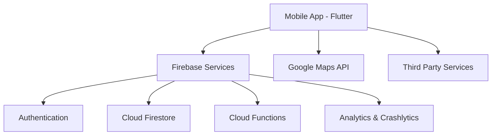
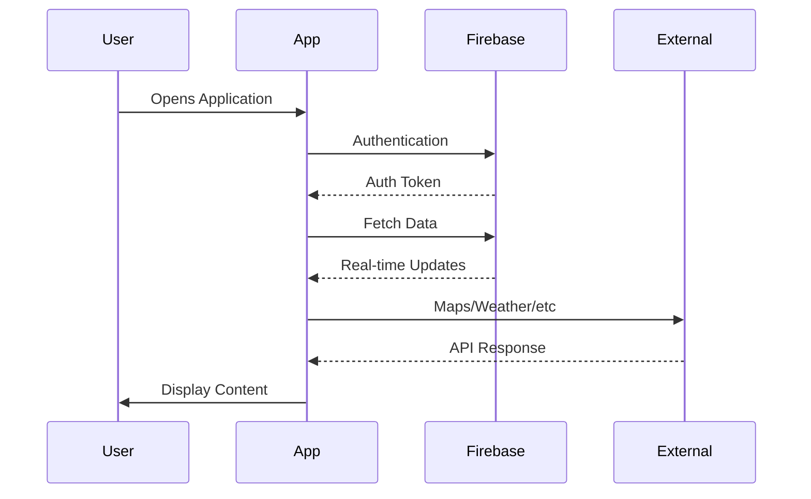

# System Overview

## Architecture Overview

The Explore Uganda App is built on a modern, scalable architecture that combines Flutter's cross-platform capabilities with Firebase's robust backend services.

## Core Components

### Mobile Application
- **Platform**: Cross-platform (iOS & Android)
- **Framework**: Flutter/Dart
- **UI Components**: Material Design & Cupertino
- **State Management**: Provider/Bloc Pattern

### Backend Services
- **Database**: Firebase Cloud Firestore
- **Authentication**: Firebase Auth
- **Cloud Functions**: Node.js
- **File Storage**: Firebase Storage

### External Services
- **Mapping**: Google Maps API
- **Analytics**: Firebase Analytics
- **Crash Reporting**: Firebase Crashlytics
- **Push Notifications**: Firebase Cloud Messaging

## Key Features

### For Tourists
- Interactive map with attractions
- Real-time event updates
- Accommodation booking
- Activity planning
- Local guides connection

### For Investors
- Market analytics dashboard
- Investment opportunity tracking
- Industry data visualization
- ROI calculators
- Business networking

### For Service Providers
- Business listing management
- Real-time booking system
- Analytics dashboard
- Customer feedback system
- Promotional tools

## System Requirements

### Mobile App
- **iOS**: Version 13.0 or later
  - iPhone 6s or newer
  - 2GB RAM minimum
- **Android**: Version 8.0 (Oreo) or later
  - 2GB RAM minimum
  - OpenGL ES 3.0 or later

### Backend Infrastructure
- **Database**: 
  - Cloud Firestore with automatic scaling
  - Daily backup enabled
- **Storage**:
  - Firebase Storage with regional redundancy
  - Content delivery network (CDN) enabled
- **Functions**:
  - Node.js runtime
  - Automatic scaling enabled

## Performance Metrics

### Target Metrics
- App Launch Time: < 2 seconds
- Screen Transition: < 300ms
- API Response Time: < 500ms
- Offline Functionality: Core features available
- Battery Impact: < 5% per hour of active use

### Monitoring
- Real-time performance monitoring
- Automated alerting system
- User behavior analytics
- Crash reporting and analysis

## Scalability

The system is designed to handle:
- 100,000+ concurrent users
- 1M+ database reads per day
- 500,000+ database writes per day
- 10TB+ media storage
- Real-time synchronization across devices

## Data Flow

## Future Roadmap

### Short Term (3-6 months)
- [ ] Offline mode enhancement
- [ ] Advanced search capabilities
- [ ] Multi-language support
- [ ] Payment gateway integration

### Long Term (6-12 months)
- [ ] AI-powered recommendations
- [ ] AR navigation features
- [ ] Virtual tour capabilities
- [ ] Blockchain integration for transactions

## Related Documentation
- [Technology Stack](Technology-Stack)
- [Security & Permissions](Security-and-Permissions)
- [API Documentation](API-and-Integrations)
- [Deployment Guide](Deployment-Guide) 