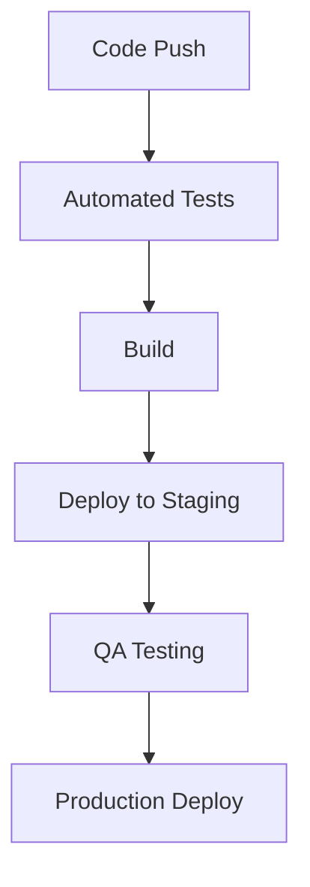

# Technology Stack

## Frontend Technologies

### Core Framework
- **Flutter SDK**: v3.x
  - Cross-platform development
  - Hot reload support
  - Widget-based architecture
  - Custom animations

### State Management
- **Provider Pattern**
  - Reactive state management
  - Dependency injection
  - Observable pattern implementation
- **Bloc Pattern**
  - Business logic components
  - Event-driven architecture
  - Stream-based state management

### UI Components
- **Material Design**
  - Responsive layouts
  - Custom themes
  - Adaptive components
- **Custom Widgets**
  - Reusable components
  - Animated elements
  - Platform-specific adaptations

## Backend Technologies

### Firebase Services
- **Authentication**
  - Multi-provider auth support
  - JWT token management
  - OAuth 2.0 integration
  - Secure session handling

- **Cloud Firestore**
  - NoSQL database
  - Real-time updates
  - Offline data persistence
  - Automatic scaling

- **Cloud Functions**
  - Node.js runtime
  - Serverless architecture
  - Event-driven functions
  - Background tasks

- **Cloud Storage**
  - Secure file storage
  - CDN integration
  - Image optimization
  - Access control

### APIs and Integration

#### Google Maps Platform
- Maps SDK for Android/iOS
- Places API
- Directions API
- Geocoding API

#### Analytics and Monitoring
- Firebase Analytics
- Crashlytics
- Performance Monitoring
- Remote Config

## Development Tools

### IDE and Extensions
- **VS Code / Android Studio**
  - Flutter/Dart plugins
  - Code analysis tools
  - Debugging tools
  - Hot reload support

### Version Control
- **Git**
  - Feature branch workflow
  - Pull request reviews
  - Semantic versioning
  - Automated CI/CD

### Testing Framework
- **Flutter Test**
  - Unit tests
  - Widget tests
  - Integration tests
- **Firebase Test Lab**
  - Device testing
  - Performance testing

## Security Implementation

### Authentication


### Data Security
- End-to-end encryption
- Secure local storage
- Data validation
- Access control rules

## Performance Optimization

### Code Level
- Lazy loading
- Memory management
- Image optimization
- Cache management

### Network Level
- API response caching
- Offline first approach
- Background sync
- Batch operations

## Dependencies

### Core Dependencies
```yaml
dependencies:
  flutter:
    sdk: flutter
  firebase_core: ^2.x.x
  firebase_auth: ^4.x.x
  cloud_firestore: ^4.x.x
  google_maps_flutter: ^2.x.x
  provider: ^6.x.x
  http: ^1.x.x
  shared_preferences: ^2.x.x
  flutter_secure_storage: ^8.x.x
```

### Dev Dependencies
```yaml
dev_dependencies:
  flutter_test:
    sdk: flutter
  flutter_lints: ^2.x.x
  build_runner: ^2.x.x
  mockito: ^5.x.x
```

## Build and Release Process

### Development Workflow
1. Local development
2. Code review
3. Automated testing
4. Staging deployment
5. Production release

### CI/CD Pipeline


## Environment Setup

### Development Environment
- Flutter SDK setup
- Firebase project configuration
- API key management
- Local environment variables

### Production Environment
- Release signing
- API restrictions
- Performance monitoring
- Error tracking

## Related Documentation
- [System Overview](System-Overview)
- [Deployment Guide](Deployment-Guide)
- [API Documentation](API-and-Integrations) 