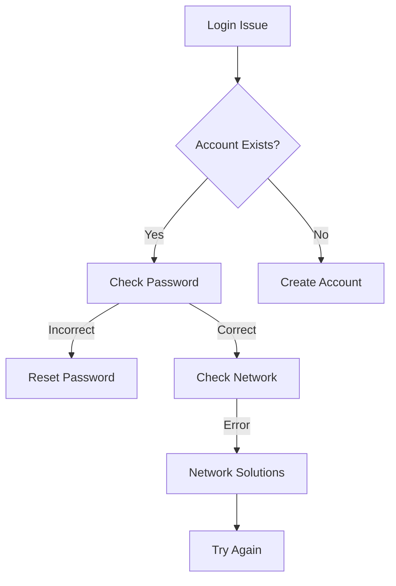
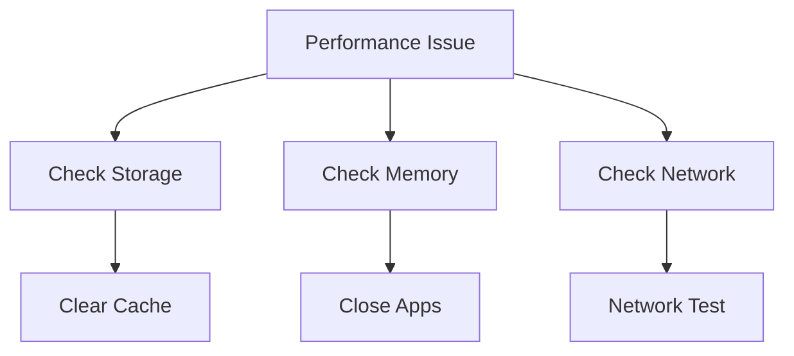

# Troubleshooting Guide

## Common Issues and Solutions

### Installation Issues

#### App Won't Install
1. **Check Device Compatibility**
   - iOS: iPhone 6s or later, iOS 13.0+
   - Android: 2GB RAM, Android 8.0+

2. **Storage Space**
   - Free up at least 200MB
   - Clear cache and temporary files
   - Remove unused apps

3. **Network Issues**
   - Switch to stable WiFi
   - Try mobile data
   - Reset network settings

### Authentication Problems

#### Unable to Login


1. **Password Issues**
   - Use "Forgot Password"
   - Check caps lock
   - Clear browser cache

2. **Google Sign-In**
   - Update Google Play Services
   - Check Google account
   - Clear Google app cache

3. **Apple Sign-In**
   - Verify Apple ID
   - Check iOS version
   - Update Apple ID settings

### Location Services

#### Location Not Working
1. **Check Permissions**
   ```dart
   // Required Permissions
   <key>NSLocationWhenInUseUsageDescription</key>
   <string>Required for showing nearby attractions</string>
   ```

2. **GPS Issues**
   - Enable GPS
   - Check GPS signal
   - Restart location services

3. **App Settings**
   - Grant location access
   - Enable precise location
   - Allow background location

### Map Problems

#### Map Not Loading
1. **Network Check**
   - Verify internet connection
   - Try different network
   - Clear app cache

2. **Google Maps**
   - Update Google Play Services
   - Clear Maps cache
   - Check API key status

3. **Display Issues**
   - Restart app
   - Update app
   - Check device compatibility

### Performance Issues

#### App Running Slowly


1. **Memory Management**
   - Close background apps
   - Clear app cache
   - Restart device

2. **Storage Space**
   - Free up storage
   - Clear app data
   - Remove unused content

3. **Network Speed**
   - Test connection speed
   - Switch networks
   - Reset network settings

### Booking System

#### Booking Failures
1. **Payment Issues**
   - Verify payment method
   - Check transaction limits
   - Contact bank if needed

2. **System Errors**
   ```dart
   // Example Error Handling
   try {
     await processBooking();
   } catch (e) {
     if (e is PaymentError) {
       // Handle payment issues
     } else if (e is NetworkError) {
       // Handle network issues
     }
   }
   ```

3. **Availability Issues**
   - Check dates
   - Verify room availability
   - Try alternative dates

### Content Issues

#### Content Not Loading
1. **Cache Problems**
   - Clear app cache
   - Force refresh content
   - Update app

2. **Network Issues**
   - Check connection
   - Try different network
   - Reset network settings

3. **App Version**
   - Check for updates
   - Reinstall app
   - Clear app data

### Notification Problems

#### Not Receiving Notifications
1. **Device Settings**
   - Enable notifications
   - Check Do Not Disturb
   - Allow background refresh

2. **App Settings**
   - Enable in-app notifications
   - Check notification categories
   - Verify push permissions

3. **System Issues**
   - Restart device
   - Reinstall app
   - Reset notification settings

## Error Codes

### Common Error Codes
| Code | Description | Solution |
|------|-------------|----------|
| E001 | Network Error | Check internet connection |
| E002 | Authentication Failed | Verify credentials |
| E003 | Location Error | Check GPS settings |
| E004 | Payment Failed | Verify payment method |
| E005 | Booking Error | Try again or contact support |

### Error Reporting
```dart
// Example Error Reporting
void reportError(String code, String message) {
  FirebaseCrashlytics.instance.recordError(
    Exception('$code: $message'),
    StackTrace.current,
    reason: 'User reported issue'
  );
}
```

## Contact Support

### Support Channels
1. **In-App Support**
   - Live chat
   - Help center
   - FAQ section

2. **Email Support**
   - support@exploreuganda.app
   - 24-48 hour response time

3. **Emergency Support**
   - For urgent issues
   - Available 24/7
   - Priority response

## Related Documentation
- [User Guide](User-Guide)
- [FAQ](FAQ)
- [Security & Permissions](Security-and-Permissions) 