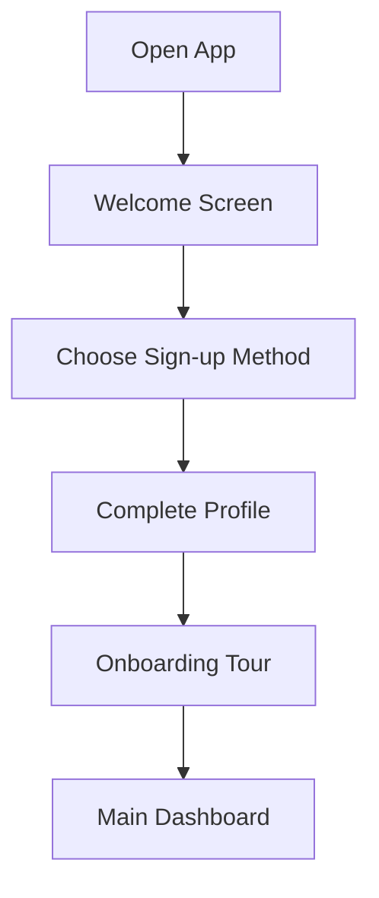
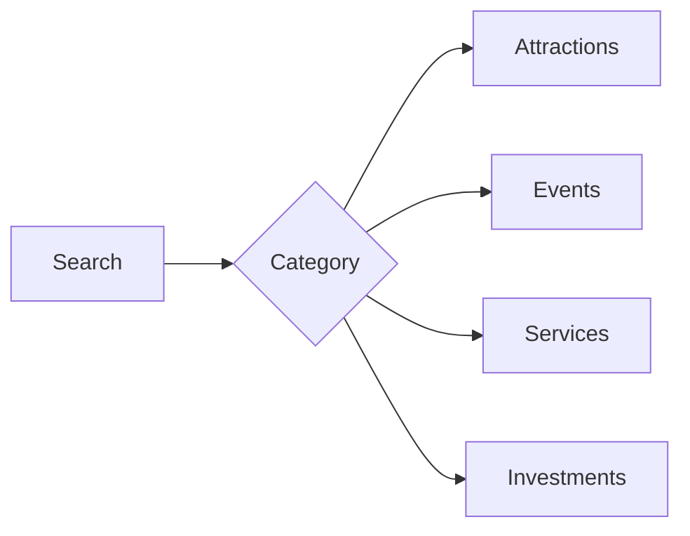

# User Guide

## Table of Contents
- [Getting Started](#getting-started)
- [App Navigation](#app-navigation)
- [Core Features](#core-features)
- [Tourist Features](#tourist-features)
- [Investor Features](#investor-features)
- [Service Provider Features](#service-provider-features)
- [Settings & Preferences](#settings--preferences)

## Getting Started

### Installation
1. **iOS Installation**
   - Open App Store
   - Search for "Explore Uganda"
   - Tap "Get" to download
   - Open the app

2. **Android Installation**
   - Open Google Play Store
   - Search for "Explore Uganda"
   - Tap "Install"
   - Open the app

### System Requirements
| Platform | Requirements |
|----------|--------------|
| iOS | iPhone 6s or later, iOS 13.0+ |
| Android | 2GB RAM, Android 8.0+ |
| Network | 3G or better |

### First-Time Setup


## App Navigation

### Top Navigation Bar

- Profile access
- Wishlist counter
- Search functionality
- Notifications center

### Bottom Navigation Bar
1. **Home Tab**
   - Featured attractions
   - Current events
   - Popular accommodations
   - Investment highlights

2. **To-Do Tab**
   - Event categories:
     - Music
     - Art
     - Agriculture
     - Technology
     - Food
     - MICE

3. **Explore Tab**
   - Interactive map
   - Nearby services
   - Route planning
   - Location tracking

4. **Marketplace Tab**
   - Tour operators
   - Fleet services
   - HORECA providers
   - Service bookings

5. **More Features Tab**
   - Profile settings
   - Language options
   - Notifications
   - Support access

## Core Features

### Account Management
1. **Registration Options**
   - Email/Password
   - Google Sign-In
   - Apple Sign-In (iOS)

2. **Profile Setup**
   - Personal information
   - Preferences
   - Interests
   - Profile picture

3. **Account Settings**
   - Security settings
   - Privacy options
   - Notification preferences
   - Language selection

### Search & Discovery


1. **Search Methods**
   - Keyword search
   - Category browsing
   - Map exploration
   - Filters and sorting

2. **Filter Options**
   - Location
   - Price range
   - Rating
   - Category
   - Availability

## Tourist Features

### Attraction Discovery
1. **Browse Attractions**
   - View details
   - See photos
   - Read reviews
   - Get directions

2. **Planning Tools**
   - Save to wishlist
   - Create itineraries
   - Share with others
   - Book activities

### Accommodation Booking
1. **Search Options**
   - Location-based
   - Date range
   - Room type
   - Price range

2. **Booking Process**
   ```mermaid
   graph TD
       A[Select Accommodation] --> B[Choose Dates]
       B --> C[Select Room]
       C --> D[Enter Details]
       D --> E[Confirm Booking]
       E --> F[Receive Confirmation]
   ```

### Event Participation
1. **Event Discovery**
   - Browse categories
   - View event details
   - Check availability
   - Get tickets

2. **Event Features**
   - Calendar integration
   - Reminders
   - Directions
   - Share with friends

## Investor Features

### Investment Opportunities
1. **Browse Investments**
   - Tourism projects
   - Property developments
   - Business ventures
   - Partnership opportunities

2. **Analysis Tools**
   - Market data
   - ROI calculator
   - Risk assessment
   - Trend analysis

### Business Intelligence
1. **Market Insights**
   - Tourism statistics
   - Market trends
   - Competitor analysis
   - Growth projections

2. **Networking Tools**
   - Connect with partners
   - Industry events
   - Business forums
   - Expert consultations

## Service Provider Features

### Business Management
1. **Listing Management**
   - Create listings
   - Update information
   - Manage availability
   - Set pricing

2. **Booking Management**
   ```mermaid
   graph TD
       A[Receive Booking] --> B[Review Details]
       B --> C[Confirm/Reject]
       C --> D[Manage Calendar]
       D --> E[Track Performance]
   ```

### Analytics Dashboard
1. **Performance Metrics**
   - Booking statistics
   - Revenue tracking
   - Customer feedback
   - Market position

2. **Customer Insights**
   - Demographics
   - Preferences
   - Booking patterns
   - Feedback analysis

## Settings & Preferences

### App Settings
1. **General Settings**
   - Language
   - Theme
   - Notifications
   - Privacy

2. **Account Settings**
   - Profile management
   - Security settings
   - Payment methods
   - Linked accounts

### Personalization
1. **Content Preferences**
   - Interests
   - Favorite categories
   - Search history
   - Recommendations

2. **Notification Settings**
   - Push notifications
   - Email preferences
   - Deal alerts
   - Event reminders

## Additional Resources
- [FAQ](FAQ)
- [Troubleshooting](Troubleshooting)
- [Support Guide](Support-Guide)
- [Terms of Service](Terms)

## Contact Support
Need help? Contact our support team:
- Email: support@exploreuganda.app
- In-app chat
- Help center
- Phone: +256 XXX XXX XXX 